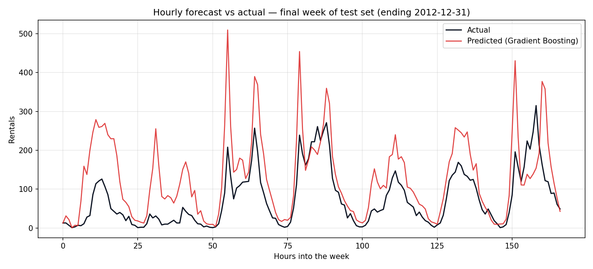
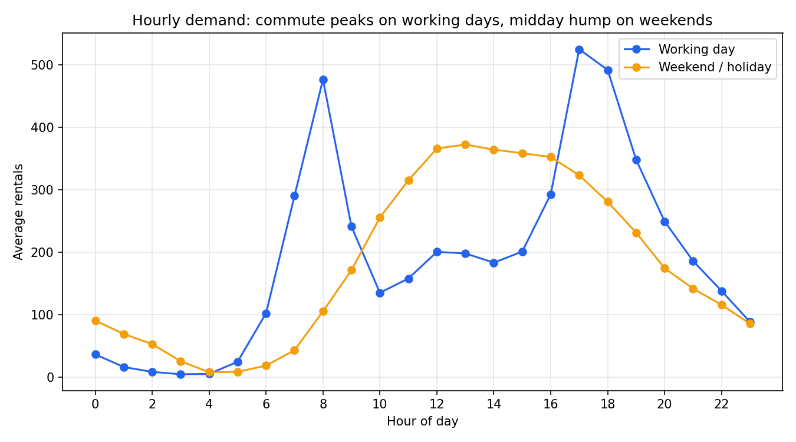

# Bike-Demand Forecast 🚲

End-to-end machine learning on real-world data: forecasting **hourly bike-share
demand** for Washington DC's Capital Bikeshare system from weather and calendar
signals — the demand signal operators need for rebalancing bikes and staffing docks.

Built with the industry stack (**pandas · scikit-learn · matplotlib**) and
evaluated the honest way: a **chronological train/test split**, so the model is
scored only on months it has never seen.

## Results

| Model | RMSE ↓ | MAE ↓ | R² ↑ |
|---|---|---|---|
| Mean baseline | 221.9 | 167.7 | −0.06 |
| Ridge regression | 158.4 | 114.5 | 0.46 |
| Random Forest | 72.6 | 48.1 | 0.89 |
| **Gradient Boosting** | **64.1** | **42.3** | **0.91** |

Test set = the final ~3 months of data (Oct–Dec 2012), never touched during training.
Gradient boosting cuts prediction error by **71% vs the mean baseline** and **60% vs
a tuned linear model** — hourly demand is dominated by *non-linear interactions*
(hour × working-day, temperature × season) that linear models can't express.



## Key findings (from the EDA)

1. **Two very different demand regimes.** Working days show sharp 8 am / 5–6 pm
   commute spikes; weekends show one broad midday hump. A single "hour" effect
   can't capture both — the models learn the interaction.
   
2. **Registered riders are commuters, casual riders are tourists.** Registered
   users (81% of all rides) drive the rush-hour peaks; casual ridership peaks
   midday and on weekends.
3. **Weather moves demand a lot.** Median hourly rentals drop by more than half
   from clear weather to light rain/snow; demand rises with temperature and
   flattens near ~30 °C.
4. **The service itself was growing.** Mean demand roughly doubled from 2011 to
   2012, so the year flag is a necessary feature — and a reminder that demand
   models go stale without retraining.

## Methodology highlights

- **No leakage, twice over.** (1) Chronological split — random splits let a model
  "see the future" through same-day rows and inflate scores. (2) `casual` and
  `registered` sum *exactly* to the target, so they're excluded from features
  (the data loader asserts this identity as an integrity check).
- **Cyclical time encoding.** Hour, month and weekday become (sin, cos) pairs so
  23:00 sits next to midnight and December next to January — a unit test proves
  the wrap-around.
- **Baseline first.** Every comparison starts from a predict-the-mean dummy model;
  improvements are measured against it, not against zero.

## Run it

```bash
pip install -r requirements.txt
python -m pytest tests/ -q   # 11 tests
python eda.py                # EDA figures + summary  -> reports/
python train.py              # model comparison + report -> reports/
```

## Project structure

```
bikeshare/          the package
  data.py           load + validate the raw CSV (schema, ranges, integrity)
  features.py       cyclical encodings, real-unit weather, X/y matrices
  evaluate.py       time-based split + RMSE/MAE/R²
  models.py         the model ladder (dummy → ridge → forest → boosting)
eda.py              exploratory analysis -> 4 figures + EDA-SUMMARY.md
train.py            train/compare models -> metrics, figures, MODEL-REPORT.md
tests/              pytest suite (data integrity, features, split, models)
data/hour.csv       UCI Bike Sharing dataset (17,379 hourly rows, 2011-2012)
```

## Data

UCI Machine Learning Repository — [Bike Sharing Dataset](https://archive.ics.uci.edu/dataset/275/bike+sharing+dataset).
Fanaee-T, Hadi & Gama, João (2013), *Event labeling combining ensemble detectors
and background knowledge*, Progress in Artificial Intelligence. Original data from
Capital Bikeshare and freemeteo.com. Citation retained in `data/Readme.txt`.

## License

MIT — see [LICENSE](LICENSE).
